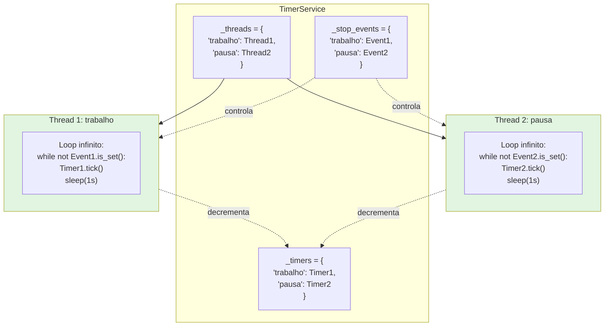
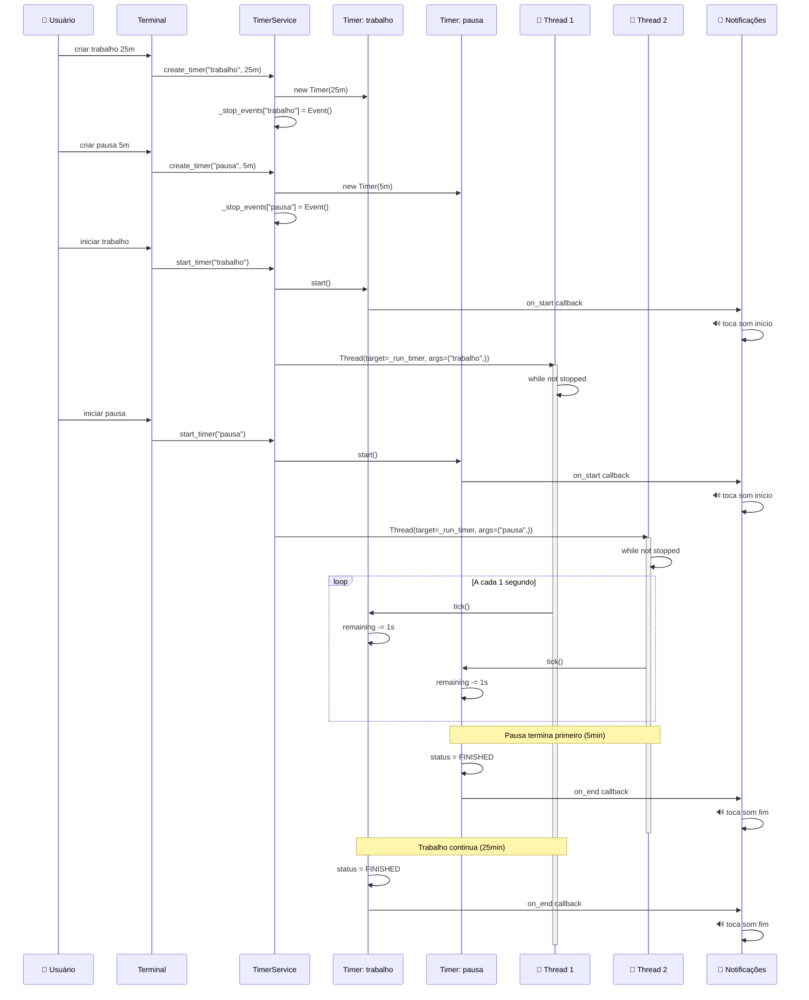
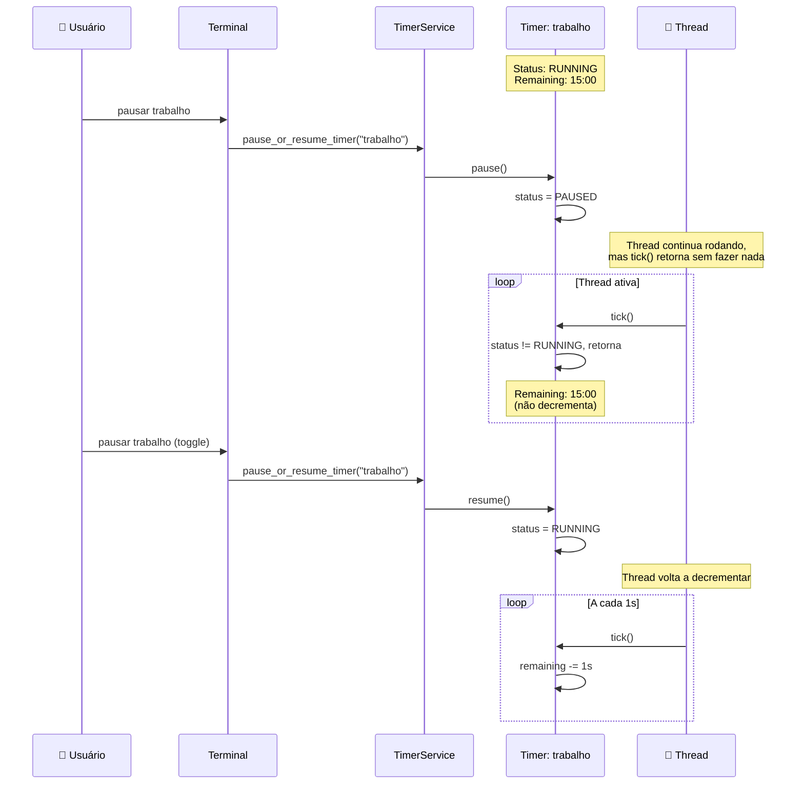

FreeTimer é um timer simples e extensível. Hoje ele oferece uma interface de Terminal funcional; outras interfaces (GUI e Web) serão adicionadas futuramente. O core é desacoplado e pensado para ser fácil de evoluir.

## Como usar (Interface de Terminal)

Pré‑requisitos:
- Python 3.13+
- uv (opcional, mas recomendado)

Passos:
1) Instalar dependências
	 - `uv sync`
2) Executar o programa
	 - `uv run python main.py`
3) Escolher a interface “Terminal” e usar os comandos:
	 - `criar` (name: str, duration: tempo)
	 - `listar`
	 - `iniciar` (name: str)
	 - `pausar` (name: str)  → alterna entre pausar/retomar
	 - `resetar` (name: str)
	 - `adicionar` (name: str, duration: tempo)

Formato de tempo aceito (duration):
- `90`  → 90 segundos
- `45m` → 45 minutos
- `1h30m` → 1 hora e 30 minutos
- `30s` → 30 segundos

Exemplo de sessão:
```
🎉 Bem-vindo ao FreeTimer!
▶️  criar: Criar timers (name, duration)
▶️  iniciar: Iniciar timer (name)
...

⌨️  Digite um comando: criar
Digite o valor para 'name' (texto): foco
⏰ Formatos de tempo aceitos...
Digite o valor para 'duration' (tempo (90, 45m, 1h30m, 30s)): 25m

⌨️  Digite um comando: iniciar
Digite o valor para 'name' (texto): foco
🟢 Timer 'foco' foi iniciado!
Tempo restante: 0:24:59
...
```

Áudio de notificação:
- Início: `Assets/Sounds/clock-start.mp3`
- Fim: `Assets/Sounds/timer-terminer.mp3`
- Desabilitar áudio (CI/servidor/sem backend): `FREETIMER_MUTE=1`

Observação: se seu sistema não tiver backend de áudio disponível (ALSA/PulseAudio etc.), o programa continuará funcionando e registrará um aviso ao tentar tocar sons.

## Como funciona (por dentro)

### Arquitetura

O FreeTimer segue uma arquitetura em camadas com separação clara de responsabilidades:

**Timer** (`src/core/timer.py`)
- Responsabilidade: Modelo de dados + lógica de contagem
- Gerencia: duração, tempo restante, status
- Métodos: `start()`, `pause()`, `resume()`, `stop()`, `reset()`, `tick()`
- **Sem threading** (mantém simplicidade e testabilidade)

**TimerService** (`src/services/timer_service.py`)
- Responsabilidade: Orquestrador de execução
- Gerencia: múltiplos timers + threads de execução
- Métodos: `create_timer()`, `start_timer()`, `stop_timer()`, `pause_or_resume_timer()`
- Coordena: uma thread por timer ativo

**Interface** (terminal, GUI, web)
- Responsabilidade: Interação com usuário
- Traduz comandos do usuário para chamadas do TimerService
- Anexa callbacks de notificação aos timers

**Notificações** (`notifications.py` + implementações)
- Contrato abstrato e implementações que tocam sons ou mostram alertas

### Fluxo de Execução

```
1. service.create_timer("trabalho", timedelta(minutes=25))
   └─> Cria Timer + threading.Event

2. service.start_timer("trabalho")
   └─> timer.start() (marca como RUNNING)
   └─> Cria thread background para executar ticks
   └─> Dispara callback on_start

3. Loop em background (thread dedicada):
   └─> Enquanto não receber sinal de parada:
       └─> Se timer.status == RUNNING:
           └─> timer.tick(seconds=1)
       └─> Aguarda 1 segundo

4. Quando timer.remaining chega a zero:
   └─> timer.status = FINISHED
   └─> Dispara callback on_end
```

Componentes principais:
- Core (`src/core/timer.py`): modelo simples que gerencia estado e lógica de contagem. Expõe eventos `on_start` e `on_end` (padrão Observer).
- Serviço (`src/services/timer_service.py`): gerencia vários timers por nome, cria threads para execução em background, expõe operações de alto nível.
- Interface de Terminal (`src/interfaces/terminal/terminal.py`): roteia comandos do usuário para o serviço e anexa callbacks de notificação.
- Notificações (`src/interfaces/notifications.py` + `src/interfaces/terminal/terminal_notification.py`): contrato abstrato e implementação que toca sons no Terminal.

### Diagrama de arquitetura

#### Visão geral do sistema

```mermaid
flowchart TB
    subgraph UI["🖥️ Camada de Interface"]
        Terminal[Terminal Interface]
        GUI[GUI Interface<br/><i>futuro</i>]
        Web[Web Interface<br/><i>futuro</i>]
    end
    
    subgraph Service["⚙️ Camada de Serviço"]
        TS[TimerService<br/>- Gerencia timers<br/>- Cria threads<br/>- Coordena execução]
    end
    
    subgraph Core["💾 Camada de Domínio"]
        T1[Timer: trabalho<br/>25min]
        T2[Timer: pausa<br/>5min]
        T3[Timer: almoço<br/>1h]
    end
    
    subgraph Threads["🧵 Threads de Execução"]
        TH1[Thread 1<br/>tick a cada 1s]
        TH2[Thread 2<br/>tick a cada 1s]
    end
    
    subgraph Notify["🔔 Notificações"]
        NS[NotificationService<br/>- Toca sons<br/>- Mostra alertas]
    end
    
    Terminal --> TS
    GUI -.-> TS
    Web -.-> TS
    
    TS -->|cria/gerencia| T1
    TS -->|cria/gerencia| T2
    TS -->|cria/gerencia| T3
    
    TS -->|inicia| TH1
    TS -->|inicia| TH2
    
    TH1 -.->|timer.tick()| T1
    TH2 -.->|timer.tick()| T2
    
    T1 -->|on_start/on_end| NS
    T2 -->|on_start/on_end| NS
    T3 -->|on_start/on_end| NS
```

#### Gerenciamento de múltiplos timers



### Sequência de execução

#### Criando e iniciando múltiplos timers



#### Pausando e retomando um timer



## Desenvolvimento

Rodar, formatar e validar:
- Executar: `uv run task run` ou `uv run python main.py`
- Formatação: `uvx ruff format`
- Lint: `uvx ruff check`

Testes (pytest):
- `uv run pytest tests/ -v`
- Dica: os testes executam com `FREETIMER_MUTE=1` para não tocar áudio.

Estrutura do projeto (resumo):
```
main.py
src/
	core/timer.py
	services/timer_service.py
	interfaces/
		base_interface.py
		terminal/
			terminal.py
			terminal_notification.py
		notifications.py
Assets/Sounds/*.mp3
tests/
	conftest.py
	test_timer.py
```

## Empacotando em executável (opcional)

Com PyInstaller (Linux):
```
uvx pyinstaller --onefile --name freetimer --console main.py \
	--add-data "Assets/Sounds:Assets/Sounds"
```
Depois, execute `./dist/freetimer`.

Observação: para ambientes gráficos e Web, novas interfaces serão adicionadas no futuro. A atual documentação foca na interface de Terminal.