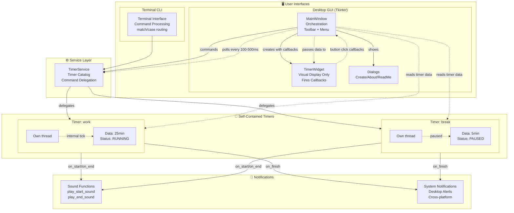

# FreeTimer

> Simple timer application with clean architecture - Terminal and GUI interfaces

[](https://github.com/frbelotto/FreeTimerAlert/releases)
[](https://www.python.org/downloads/)
[](https://github.com/astral-sh/ruff)
[](LICENSE)

FreeTimer is a lightweight timer application with a clean architecture designed for simplicity and ease of use. Available as both terminal and desktop GUI interfaces. Perfect for Pomodoro technique, time management, or any task requiring multiple concurrent timers.

## Table of Contents

- [Features](#features)
- [Quick Start](#quick-start)
- [Usage](#usage)
- [Command-Line Options](#command-line-options)
- [Architecture](#architecture)
- [Development](#development)

## Features

- 🖥️ **Multiple interfaces** - Choose between terminal CLI or desktop GUI with full feature parity
- ⏱️ **Multiple concurrent timers** - Run several timers simultaneously with independent controls
- 🎯 **Simple time format** - Support for seconds, minutes, hours (e.g., `90`, `45m`, `1h30m`)
- 🔊 **Audio notifications** - Sound alerts when timers start and finish (toggleable in GUI)
- 🔔 **Desktop notifications** - Cross-platform system notifications when timers finish (Windows, macOS, Linux)
- 🧵 **Thread-based execution** - Each timer runs in its own thread for true concurrency
- 🎨 **Clean architecture** - Simple, well-organized codebase with clear separation of concerns
- 🔇 **Mute support** - Optional audio muting via command-line flag or GUI toggle
- 🐍 **Lightweight** - Minimal dependencies (Tkinter is Python standard library)
- ⚡ **Real-time updates** - Dynamic refresh rates (100-500ms) based on remaining time
- 🎨 **Color-coded status** - Visual indicators for running, paused, and finished timers

## Quick Start

### Prerequisites

- Python 3.11 or higher
- [uv](https://github.com/astral-sh/uv) (recommended) or pip
- **Dependencies**: `playsound3` (audio), `rich` (terminal UI), `plyer` (system notifications)
- **All systems**: Tcl/Tk libraries (required for GUI interface)
  ```bash
  # Debian/Ubuntu
  sudo apt-get install -y python3-tk
  
  # Fedora/RHEL
  sudo dnf install -y python3-tkinter
  
  # Arch
  sudo pacman -S tk
  
  # macOS (via Homebrew)
  brew install python-tk
  ```
- **Linux only**: `binutils` package (for building executables)
  ```bash
  sudo apt-get install -y binutils  # Debian/Ubuntu
  sudo dnf install -y binutils      # Fedora/RHEL
  sudo pacman -S binutils           # Arch
  ```

**Note for WSL users**: GUI interface requires X Server (VcXsrv, X410, or WSLg). If not configured, use terminal interface instead.

### Installation

```bash
# Clone the repository
git clone https://github.com/frbelotto/FreeTimerAlert.git
cd FreeTimerAlert

# Install dependencies
uv sync

# Run with unified entry point
python -m src              # GUI interface (default)
python -m src --terminal   # Terminal interface
```

## Usage

FreeTimer provides two interfaces: **Terminal** (CLI) and **Desktop GUI**. Choose the one that best fits your workflow.

### Unified Entry Point (Recommended)

```bash
# GUI interface (default)
python -m src
python -m src --debug --mute

# Terminal interface
python -m src --terminal
python -m src --terminal --debug --mute
```

### Desktop GUI Interface

```bash
# Run GUI (default)
python -m src

# With options
python -m src --debug --mute
```

### Using the Compiled Executable

After building with `python build.py`, you can run the standalone executable (see [Building Executable Guide](docs/EXECUTABLE_BUILD.md)):

```bash
# Navigate to the dist folder
cd dist

# Run GUI (default)
./FreeTimer

# Run Terminal interface
./FreeTimer --terminal

# With debug logging
./FreeTimer --debug
```

**System Requirements:**
- Tcl/Tk libraries must be installed on the target system
- GUI requires X11/Wayland display server (not available in headless environments)
- **WSL users**: Terminal interface works everywhere, GUI requires X Server setup

**Status**: ✅ Fully functional

The GUI provides a complete desktop experience with:

**Core Features:**
- ✅ **Visual timer management** - Real-time display of all active timers with color-coded status
- ✅ **Intuitive controls** - Click-based interface for all timer operations
- ✅ **Live updates** - Automatic refresh (100-500ms intervals based on remaining time)
- ✅ **Status indicators** - Color-coded visual feedback (🟢 Running / ⏸️ Paused / ✅ Finished)
- ✅ **Sound toggle** - Toolbar button to enable/disable audio notifications
- ✅ **Desktop notifications** - System notifications when timers finish (cross-platform)
- ✅ **Scrollable interface** - Manage unlimited timers with smooth scrolling
- ✅ **Input validation** - Smart dialogs with error handling and helpful examples
- ✅ **Keyboard shortcuts** - Enter to confirm, Escape to cancel
- ✅ **Help system** - Built-in README viewer and About dialog

**Components:**
- **Timer Widget**: Individual display for each timer showing:
  - Timer name, status, and remaining time (HH:MM:SS format)
  - Duration information and progress
  - Control buttons: Start, Pause, Reset, Delete
  - Color-coded frame based on timer state

- **Create Timer Dialog**: User-friendly input with:
  - Name validation (non-empty, unique)
  - Time format helper text with examples
  - Real-time validation feedback
  - Multiple format support (90, 45m, 1h30m, 30s)

- **Main Window**: Central interface featuring:
  - Toolbar with Create Timer and Sound Toggle buttons
  - Scrollable canvas for timer list
  - Menu bar with File and Help options
  - Status indicators and system integration

### Terminal Interface

```bash
# Run terminal interface
python -m src --terminal

# With options
python -m src --terminal --debug --mute
```

The terminal interface provides:

- Command-based interaction
- Full control via keyboard
- Lightweight and fast
- Perfect for SSH/remote sessions

**Commands:**

| Command | Arguments | Description |
|---------|-----------|-------------|
| `create` | name, duration | Create a new timer |
| `list` | - | List all timers |
| `start` | name | Start a timer |
| `pause` | name | Toggle pause/resume |
| `reset` | name | Reset timer to initial duration |
| `add` | name, duration | Add time to a timer |
| `remove` | name | Remove finished/stopped timer |

### Time Format

FreeTimer accepts flexible time formats:

| Format | Example | Result |
|--------|---------|--------|
| Seconds only | `90` | 90 seconds |
| Minutes | `45m` | 45 minutes |
| Hours + Minutes | `1h30m` | 1 hour 30 minutes |
| Explicit seconds | `30s` | 30 seconds |

### Example Session

```bash
🎉 Welcome to FreeTimer!
▶️  create: Create timers (name, duration)
▶️  start: Start timer (name)
...

⌨️  Enter command: create
Enter value for 'name' (text): focus
⏰ Accepted time formats...
Enter value for 'duration' (time (90, 45m, 1h30m, 30s)): 25m

⌨️  Enter command: start
Enter value for 'name' (text): focus
🟢 Timer 'focus' started!
Time remaining: 0:24:59
...
```

### Audio Notifications

- **Start sound**: `Assets/Sounds/clock-start.mp3`
- **End sound**: `Assets/Sounds/timer-terminer.mp3`
- **Disable audio**: Use `--mute` flag

> **Note**: If your system lacks an audio backend (ALSA/PulseAudio on Linux), the application will continue to work and log a warning when attempting to play sounds. On Linux, you may need to install `gobject` and `cairo` development libraries if `playsound3` requires them.

## Command-Line Options

The unified entry point supports the following options:

| Option | Description |
|--------|-------------|
| `--terminal` | Launch terminal interface (default is GUI) |
| `--debug` | Enable debug logging output |
| `--mute` | Disable sound notifications |

### Examples

```bash
# GUI interface (default)
python -m src
python -m src --debug --mute

# Terminal interface
python -m src --terminal
python -m src --terminal --debug --mute

# Legacy entry points (backward compatible)
python main.py --debug --mute

FreeTimer follows a clean layered architecture with clear separation of concerns:

### Core Components

#### **Timer** (`src/core/timer.py`)
- **Responsibility**: Self-contained timer with complete lifecycle management
- **Implementation**: Python dataclass with threading support
- **Manages**: duration, remaining time, status, and its own execution thread
- **Methods**: `start()`, `pause()`, `resume()`, `stop()`, `reset()`, `add_time()`
- **Thread-safe**: Uses locks for all state modifications

#### **TimerService** (`src/services/timer_service.py`)
- **Responsibility**: Coordinator for multiple named timers
- **Manages**: catalog of timers by name
- **Methods**: `create_timer()`, `start_timer()`, `stop_timer()`, `pause_or_resume_timer()`, `remove_timer()`
- **Delegates**: Forwards commands to individual timers

#### **Terminal Interface** (`src/interfaces/terminal/interface.py`)
- **Responsibility**: User interaction and command processing via CLI
- **Uses**: match/case statements for command routing
- **Configures**: Sound notification callbacks during timer creation

#### **GUI Interface** (`src/interfaces/gui/main_window.py`)
- **Responsibility**: Desktop graphical user interface using Tkinter
- **Components**: 
  - `MainWindow` - Main application window, toolbar, menu bar, and orchestration
  - `TimerWidget` (`timer_widget.py`) - Individual timer display with controls and status
  - `CreateTimerDialog` (`dialogs.py`) - Timer creation dialog with validation
  - `AboutDialog` (`dialogs.py`) - Application information dialog
  - `ReadMeDialog` (`dialogs.py`) - Built-in README viewer
- **Features**: 
  - Real-time updates with dynamic refresh rates (100-500ms)
  - Sound toggle for audio notifications
  - Scrollable timer list for unlimited timers
  - Cross-platform system notifications (via `system_notifications.py`)
  - Color-coded status indicators (green=running, yellow=paused, blue=finished)
- **Status**: ✅ Fully functional
- **Reuses**: Same `TimerService` and `Timer` core logic as terminal interface

#### **Notifications** (`src/interfaces/terminal/notifications.py`)
- **Functional module**: Uses simple functions instead of classes
- **Functions**: `play_start_sound()`, `play_end_sound()`
- **Handles**: Audio playback with graceful error handling

#### **System Notifications** (`src/services/system_notifications.py`)
- **Responsibility**: Cross-platform desktop/system notifications
- **Functions**: `show_notification()`, `show_timer_finished_notification()`
- **Platform support**: Windows (plyer), macOS (osascript), Linux (notify-send/plyer)
- **Graceful handling**: WSL detection, fallback mechanisms, silent failure
- **Used by**: GUI interface for timer completion alerts

### Architecture Diagram



### Project Structure

```
src/
    __main__.py             # Unified entry point (NEW!)
    core/
        timer.py            # Self-contained timer (dataclass + threading)
    services/
        timer_service.py          # Multiple timer coordinator
        logger.py                 # Logging configuration (functional)
        parse_utils.py            # Time parsing utilities
        system_notifications.py   # Cross-platform desktop notifications
    interfaces/
        terminal/
            interface.py    # Terminal UI implementation
            notifications.py # Sound notification functions
        gui/
            main_window.py  # GUI main window (Tkinter)
            timer_widget.py # Timer display widget
            dialogs.py      # Dialog windows (Create/About/ReadMe)
main.py                     # Legacy terminal entry point
gui.py                      # Legacy GUI entry point
build.py                    # Executable builder script
Assets/
    Sounds/
        clock-start.mp3         # Start notification sound
        timer-terminer.mp3      # End notification sound
tests/
    core/
        test_timer.py              # Timer unit tests
        conftest.py                # Pytest fixtures
    services/
        test_logger.py             # Logger tests
        test_timer_service.py      # TimerService tests
        test_parse_utils.py        # Time parsing tests
    gui/
        test_main_window.py        # GUI main window tests
        test_timer_widget.py       # Timer widget tests
        test_dialogs.py            # Dialog tests
        conftest.py                # GUI test fixtures
    terminal/
        test_notifications.py      # Sound notification tests
```

## Development
### Running and Testing

```bash
# Run GUI interface (default)
python -m src
python -m src --debug --mute

# Run terminal interface
python -m src --terminal
python -m src --terminal --debug --mute

# Or using task runner
uv run task run              # GUI interface (default)
uv run task terminal         # Terminal interface

# Format code
uv run task format

# Run tests
uv run task test

# Run tests (fast - exclude slow and integration tests)
uv run task test-fast

# Run all tests with detailed output
uv run task test-all

# Run only build tests
uv run task test-build
```

> **Note**: Tests run with `FREETIMER_MUTE=1` to suppress audio during testing.

### Building Executable

To create a standalone executable for distribution:

```bash
# Install build dependencies
uv sync --group build

# Build executable (creates dist/FreeTimer or dist/FreeTimer.exe)
python build.py

# Or using task runner
uv run task build
```

The build process uses PyInstaller to create a single executable file that includes:
- Python runtime
- All dependencies
- Sound assets
- Application code

**Executable location**: `dist/FreeTimer` (Linux/macOS) or `dist/FreeTimer.exe` (Windows)

### Code Quality

The project follows these standards:
- **Type hints**: All functions include type annotations
- **Docstrings**: Descriptive documentation in English
- **Logging**: Structured logging via `logger` (no `print()` statements in core code)
- **Testing**: Pytest with comprehensive test coverage
- **Linting**: Ruff for code style enforcement
- **Minimal dependencies**: Only essential libraries (playsound3, rich)

## Platform Compatibility

FreeTimer is designed to work across:
- ✅ Linux (tested)
- ✅ macOS
- ✅ Windows

## Contributing

Contributions are welcome! Please ensure:
- Code follows project style (use `ruff format` and `ruff check`)
- All tests pass (`pytest tests/ -v`)
- New features include tests
- Documentation is updated

## License

Creative Commons Attribution-NonCommercial-ShareAlike 4.0 International (CC BY-NC-SA 4.0) - see LICENSE file for details

---

**Built with ❤️ for productivity and time management**
