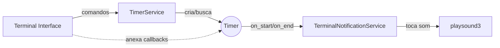
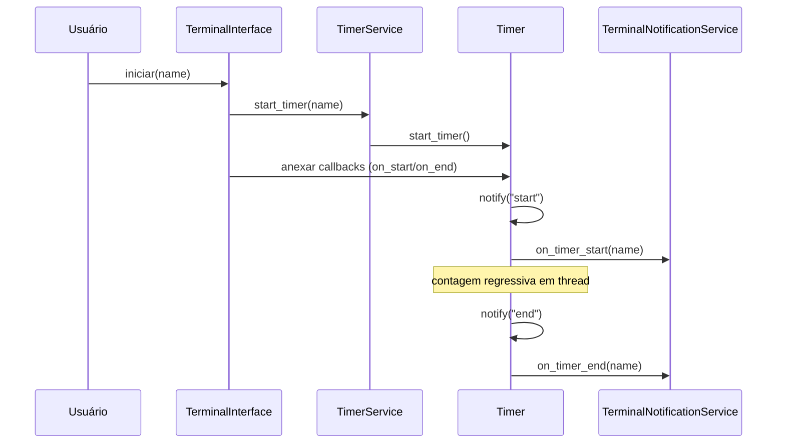

FreeTimer é um timer simples e extensível. Hoje ele oferece uma interface de Terminal funcional; outras interfaces (GUI e Web) serão adicionadas futuramente. O core é desacoplado e pensado para ser fácil de evoluir.

## Como usar (Interface de Terminal)

Pré‑requisitos:
- Python 3.13+
- uv (opcional, mas recomendado)

Passos:
1) Instalar dependências
	 - `uv sync`
2) Executar o programa
	 - `uv run python main.py`
3) Escolher a interface “Terminal” e usar os comandos:
	 - `criar` (name: str, duration: tempo)
	 - `listar`
	 - `iniciar` (name: str)
	 - `pausar` (name: str)  → alterna entre pausar/retomar
	 - `resetar` (name: str)
	 - `adicionar` (name: str, duration: tempo)

Formato de tempo aceito (duration):
- `90`  → 90 segundos
- `45m` → 45 minutos
- `1h30m` → 1 hora e 30 minutos
- `30s` → 30 segundos

Exemplo de sessão:
```
🎉 Bem-vindo ao FreeTimer!
▶️  criar: Criar timers (name, duration)
▶️  iniciar: Iniciar timer (name)
...

⌨️  Digite um comando: criar
Digite o valor para 'name' (texto): foco
⏰ Formatos de tempo aceitos...
Digite o valor para 'duration' (tempo (90, 45m, 1h30m, 30s)): 25m

⌨️  Digite um comando: iniciar
Digite o valor para 'name' (texto): foco
🟢 Timer 'foco' foi iniciado!
Tempo restante: 0:24:59
...
```

Áudio de notificação:
- Início: `Assets/Sounds/clock-start.mp3`
- Fim: `Assets/Sounds/timer-terminer.mp3`
- Desabilitar áudio (CI/servidor/sem backend): `FREETIMER_MUTE=1`

Observação: se seu sistema não tiver backend de áudio disponível (ALSA/PulseAudio etc.), o programa continuará funcionando e registrará um aviso ao tentar tocar sons.

## Como funciona (por dentro)

Componentes principais:
- Core (`src/core/timer.py`): implementa um timer que roda em uma thread, expõe eventos `on_start` e `on_end` (Observer) e notifica ouvintes cadastrados.
- Serviço (`src/services/timer_service.py`): gerencia vários timers por nome e expõe operações de alto nível (criar, iniciar, pausar, resetar, adicionar tempo, listar).
- Interface de Terminal (`src/interfaces/terminal/terminal.py`): roteia comandos do usuário para o serviço, e “anexa” callbacks de notificação aos timers.
- Notificações (`src/interfaces/notifications.py` + `src/interfaces/terminal/terminal_notification.py`): contrato abstrato e implementação que toca sons no Terminal.

### Diagrama de arquitetura (Mermaid)



### Sequência de execução (Mermaid)



## Desenvolvimento

Rodar, formatar e validar:
- Executar: `uv run task run` ou `uv run python main.py`
- Formatação: `uvx ruff format`
- Lint: `uvx ruff check`

Testes (pytest):
- `uv run pytest tests/ -v`
- Dica: os testes executam com `FREETIMER_MUTE=1` para não tocar áudio.

Estrutura do projeto (resumo):
```
main.py
src/
	core/timer.py
	services/timer_service.py
	interfaces/
		base_interface.py
		terminal/
			terminal.py
			terminal_notification.py
		notifications.py
Assets/Sounds/*.mp3
tests/
	conftest.py
	test_timer.py
```

## Empacotando em executável (opcional)

Com PyInstaller (Linux):
```
uvx pyinstaller --onefile --name freetimer --console main.py \
	--add-data "Assets/Sounds:Assets/Sounds"
```
Depois, execute `./dist/freetimer`.

Observação: para ambientes gráficos e Web, novas interfaces serão adicionadas no futuro. A atual documentação foca na interface de Terminal.