# FreeTimer

> Simple timer application with clean architecture - Terminal and GUI interfaces

[](https://www.python.org/downloads/)
[](https://github.com/astral-sh/ruff)
[](LICENSE)

FreeTimer is a lightweight timer application with a clean architecture designed for simplicity and ease of use. Available as both terminal and desktop GUI interfaces. Perfect for Pomodoro technique, time management, or any task requiring multiple concurrent timers.

## Table of Contents

- [Features](#features)
- [Quick Start](#quick-start)
- [Usage](#usage)
- [Command-Line Options](#command-line-options)
- [Architecture](#architecture)
- [Development](#development)

## Features

- 🖥️ **Multiple interfaces** - Choose between terminal CLI or desktop GUI
- ⏱️ **Multiple concurrent timers** - Run several timers simultaneously with independent controls
- 🎯 **Simple time format** - Support for seconds, minutes, hours (e.g., `90`, `45m`, `1h30m`)
- 🔊 **Audio notifications** - Sound alerts when timers start and finish
- 🧵 **Thread-based execution** - Each timer runs in its own thread for true concurrency
- 🎨 **Clean architecture** - Simple, well-organized codebase
- 🔇 **Mute support** - Optional audio muting via command-line flag
- 🐍 **Lightweight** - Minimal dependencies (Tkinter is Python standard library)

## Quick Start

### Prerequisites

- Python 3.11 or higher
- [uv](https://github.com/astral-sh/uv) (recommended) or pip

### Installation

```bash
# Clone the repository
git clone https://github.com/frbelotto/FreeTimerAlert.git
cd FreeTimerAlert

# Install dependencies
uv sync

# Run with unified entry point (recommended)
python -m src              # Terminal interface
python -m src --gui        # GUI interface

# Or use legacy entry points
python main.py             # Terminal interface
python gui.py              # GUI interface
```

## Usage

FreeTimer provides two interfaces: **Terminal** (CLI) and **Desktop GUI**. Choose the one that best fits your workflow.

### Unified Entry Point (Recommended)

```bash
# Terminal interface (default)
python -m src
python -m src --debug --mute

# GUI interface
python -m src --gui
python -m src --gui --debug
```

### Desktop GUI Interface

```bash
# Modern way
python -m src --gui

# With options
python gui.py --debug
python gui.py --mute
```

The GUI provides:
- Visual list of all active timers
- Click-based controls (create, start, pause, reset, remove)
- Real-time timer updates
- Desktop notifications
- Intuitive interface for casual users

**Status**: 🚧 In development (basic window implemented)

### Terminal Interface

```bash
# Modern way
python -m src

# Legacy way (still supported)
python main.py

# With options
python -m src --debug --mute
```

The terminal interface provides:

- Command-based interaction
- Full control via keyboard
- Lightweight and fast
- Perfect for SSH/remote sessions

**Commands:**

| Command | Arguments | Description |
|---------|-----------|-------------|
| `create` | name, duration | Create a new timer |
| `list` | - | List all timers |
| `start` | name | Start a timer |
| `pause` | name | Toggle pause/resume |
| `reset` | name | Reset timer to initial duration |
| `add` | name, duration | Add time to a timer |
| `remove` | name | Remove finished/stopped timer |

### Time Format

FreeTimer accepts flexible time formats:

| Format | Example | Result |
|--------|---------|--------|
| Seconds only | `90` | 90 seconds |
| Minutes | `45m` | 45 minutes |
| Hours + Minutes | `1h30m` | 1 hour 30 minutes |
| Explicit seconds | `30s` | 30 seconds |

### Example Session

```bash
🎉 Welcome to FreeTimer!
▶️  create: Create timers (name, duration)
▶️  start: Start timer (name)
...

⌨️  Enter command: create
Enter value for 'name' (text): focus
⏰ Accepted time formats...
Enter value for 'duration' (time (90, 45m, 1h30m, 30s)): 25m

⌨️  Enter command: start
Enter value for 'name' (text): focus
🟢 Timer 'focus' started!
Time remaining: 0:24:59
...
```

### Audio Notifications

- **Start sound**: `Assets/Sounds/clock-start.mp3`
- **End sound**: `Assets/Sounds/timer-terminer.mp3`
- **Disable audio**: Use `--mute` flag

> **Note**: If your system lacks an audio backend (ALSA/PulseAudio on Linux), the application will continue to work and log a warning when attempting to play sounds. On Linux, you may need to install `gobject` and `cairo` development libraries if `playsound3` requires them.

## Command-Line Options

The unified entry point supports the following options:

| Option | Description |
|--------|-------------|
| `--gui` | Launch GUI interface (default: terminal) |
| `--debug` | Enable debug logging output |
| `--mute` | Disable sound notifications |

### Examples

```bash
# Terminal interface (default)
python -m src
python -m src --debug --mute

# GUI interface
python -m src --gui
python -m src --gui --debug

# Legacy entry points (backward compatible)
python main.py --debug
python gui.py --mute
```

## Architecture

FreeTimer follows a clean layered architecture with clear separation of concerns:

### Core Components

#### **Timer** (`src/core/timer.py`)
- **Responsibility**: Self-contained timer with complete lifecycle management
- **Implementation**: Python dataclass with threading support
- **Manages**: duration, remaining time, status, and its own execution thread
- **Methods**: `start()`, `pause()`, `resume()`, `stop()`, `reset()`, `add_time()`
- **Thread-safe**: Uses locks for all state modifications

#### **TimerService** (`src/services/timer_service.py`)
- **Responsibility**: Coordinator for multiple named timers
- **Manages**: catalog of timers by name
- **Methods**: `create_timer()`, `start_timer()`, `stop_timer()`, `pause_or_resume_timer()`, `remove_timer()`
- **Delegates**: Forwards commands to individual timers

#### **Terminal Interface** (`src/interfaces/terminal/interface.py`)
- **Responsibility**: User interaction and command processing via CLI
- **Uses**: match/case statements for command routing
- **Configures**: Sound notification callbacks during timer creation

#### **GUI Interface** (`src/interfaces/gui/main_window.py`)
- **Responsibility**: Desktop graphical user interface
- **Uses**: Tkinter for cross-platform GUI
- **Status**: 🚧 In development
- **Reuses**: Same `TimerService` and `Timer` core logic

#### **Notifications** (`src/terminal/notifications.py`)
- **Functional module**: Uses simple functions instead of classes
- **Functions**: `play_start_sound()`, `play_end_sound()`
- **Handles**: Audio playback with graceful error handling

### Architecture Diagram

```mermaid
flowchart TB
    subgraph UI["🖥️ Terminal Interface"]
        Terminal[Terminal Interface<br/>Command Processing]
    end
    
    subgraph Service["⚙️ Service Layer"]
        TS[TimerService<br/>Timer Catalog<br/>Command Delegation]
    end
    
    subgraph Core["💾 Self-Contained Timers"]
        subgraph T1["Timer: work"]
            T1D[Data: 25min<br/>Status: RUNNING]
            T1T[Own thread]
        end
        subgraph T2["Timer: break"]
            T2D[Data: 5min<br/>Status: PAUSED]
            T2T[Own thread]
        end
    end
    
    subgraph Notify["🔔 Notifications"]
        NS[Sound Functions<br/>play_start_sound<br/>play_end_sound]
    end
    
    Terminal --> TS
    TS -->|delegates| T1
    TS -->|delegates| T2
    
    T1T -.->|internal tick| T1D
    T2T -.->|paused| T2D
    
    T1 -->|on_start/on_end| NS
    T2 -->|on_start/on_end| NS
```



### Project Structure

```
src/
    __main__.py             # Unified entry point (NEW!)
    core/
        timer.py            # Self-contained timer (dataclass + threading)
    services/
        timer_service.py    # Multiple timer coordinator
        logger.py           # Logging configuration (functional)
        parse_utils.py      # Time parsing utilities
    interfaces/
        terminal/
            interface.py    # Terminal UI implementation
            notifications.py # Sound notification functions
        gui/
            main_window.py  # GUI main window (Tkinter)
            timer_widget.py # Timer display widget
            dialogs.py      # Dialog windows
main.py                     # Legacy terminal entry point
gui.py                      # Legacy GUI entry point
build.py                    # Executable builder script
Assets/
    Sounds/
        clock-start.mp3         # Start notification sound
        timer-terminer.mp3      # End notification sound
tests/
    core/
        test_timer.py           # Timer unit tests
        conftest.py             # Pytest fixtures
    services/
        test_logger.py          # Logger tests
        test_timer_service.py   # TimerService tests
        test_parse_utils.py     # Time parsing tests
```

## Development
### Running and Testing

```bash
# Run terminal interface
python -m src
python -m src --debug --mute

# Run GUI interface
python -m src --gui
python -m src --gui --debug

# Or using task runner
uv run task run    # Terminal (python -m src)
uv run task gui    # GUI (python -m src --gui)minal
uv run task gui    # GUI

# Format code
uvx ruff format

# Lint code
uvx ruff check

# Run tests
uv run pytest tests/ -v

# Run tests with coverage
uv run pytest tests/ -v --cov=src
```

> **Note**: Tests run with `FREETIMER_MUTE=1` to suppress audio during testing.

### Building Executable

To create a standalone executable for distribution:

```bash
# Install build dependencies
uv sync --group build

# Build executable (creates dist/FreeTimer or dist/FreeTimer.exe)
python build.py

# Or using task runner
uv run task build
```

The build process uses PyInstaller to create a single executable file that includes:
- Python runtime
- All dependencies
- Sound assets
- Application code

**Executable location**: `dist/FreeTimer` (Linux/macOS) or `dist/FreeTimer.exe` (Windows)

### Code Quality

The project follows these standards:
- **Type hints**: All functions include type annotations
- **Docstrings**: Descriptive documentation in English
- **Logging**: Structured logging via `logger` (no `print()` statements in core code)
- **Testing**: Pytest with comprehensive test coverage
- **Linting**: Ruff for code style enforcement
- **Minimal dependencies**: Only essential libraries (playsound3, rich)

## Platform Compatibility

FreeTimer is designed to work across:
- ✅ Linux (tested)
- ✅ macOS
- ✅ Windows

## Contributing

Contributions are welcome! Please ensure:
- Code follows project style (use `ruff format` and `ruff check`)
- All tests pass (`pytest tests/ -v`)
- New features include tests
- Documentation is updated

## License

Creative Commons Attribution-NonCommercial-ShareAlike 4.0 International (CC BY-NC-SA 4.0) - see LICENSE file for details

---

**Built with ❤️ for productivity and time management**
