# FreeTimer

> Simple terminal-based timer application with clean architecture

[](https://www.python.org/downloads/)
[](https://github.com/astral-sh/ruff)
[](LICENSE)

FreeTimer is a lightweight, terminal-based timer application with a clean architecture designed for simplicity and ease of use. Perfect for Pomodoro technique, time management, or any task requiring multiple concurrent timers.

## Table of Contents

- [Features](#features)
- [Quick Start](#quick-start)
- [Usage](#usage)
- [Command-Line Options](#command-line-options)
- [Architecture](#architecture)
- [Development](#development)

## Features

- ⏱️ **Multiple concurrent timers** - Run several timers simultaneously with independent controls
- 🎯 **Simple time format** - Support for seconds, minutes, hours (e.g., `90`, `45m`, `1h30m`)
- 🔊 **Audio notifications** - Sound alerts when timers start and finish
- 🧵 **Thread-based execution** - Each timer runs in its own thread for true concurrency
- 🎨 **Clean architecture** - Simple, well-organized codebase
- 🔇 **Mute support** - Optional audio muting via command-line flag
- 🐍 **Lightweight** - Minimal dependencies

## Quick Start

### Prerequisites

- Python 3.10 or higher
- [uv](https://github.com/astral-sh/uv) (recommended) or pip

### Installation

```bash
# Clone the repository
git clone https://github.com/frbelotto/FreeTimerAlert.git
cd FreeTimerAlert

# Install dependencies
uv sync

# Run the application
uv run python main.py
```

## Usage

### Terminal Interface

The application runs entirely in the terminal. Use the following commands:

| Command | Arguments | Description |
|---------|-----------|-------------|
| `create` | name, duration | Create a new timer |
| `list` | - | List all timers |
| `start` | name | Start a timer |
| `pause` | name | Toggle pause/resume |
| `reset` | name | Reset timer to initial duration |
| `add` | name, duration | Add time to a timer |
| `remove` | name | Remove finished/stopped timer |

### Time Format

FreeTimer accepts flexible time formats:

| Format | Example | Result |
|--------|---------|--------|
| Seconds only | `90` | 90 seconds |
| Minutes | `45m` | 45 minutes |
| Hours + Minutes | `1h30m` | 1 hour 30 minutes |
| Explicit seconds | `30s` | 30 seconds |

### Example Session

```bash
🎉 Welcome to FreeTimer!
▶️  create: Create timers (name, duration)
▶️  start: Start timer (name)
...

⌨️  Enter command: create
Enter value for 'name' (text): focus
⏰ Accepted time formats...
Enter value for 'duration' (time (90, 45m, 1h30m, 30s)): 25m

⌨️  Enter command: start
Enter value for 'name' (text): focus
🟢 Timer 'focus' started!
Time remaining: 0:24:59
...
```

### Audio Notifications

- **Start sound**: `Assets/Sounds/clock-start.mp3`
- **End sound**: `Assets/Sounds/timer-terminer.mp3`
- **Disable audio**: Use `--mute` flag

> **Note**: If your system lacks an audio backend (ALSA/PulseAudio), the application will continue to work and log a warning when attempting to play sounds.

## Command-Line Options

```bash
python main.py [OPTIONS]
```

### Available Options

| Option | Description |
|--------|-------------|
| `--debug` | Enable debug logging output |
| `--mute` | Disable sound notifications |

### Examples

```bash
# Run with default settings
python main.py

# Run with debug logging
python main.py --debug

# Run without sound notifications
python main.py --mute

# Combine multiple options
python main.py --debug --mute
```

## Architecture

FreeTimer follows a clean layered architecture with clear separation of concerns:

### Core Components

#### **Timer** (`src/core/timer.py`)
- **Responsibility**: Self-contained timer with complete lifecycle management
- **Implementation**: Python dataclass with threading support
- **Manages**: duration, remaining time, status, and its own execution thread
- **Methods**: `start()`, `pause()`, `resume()`, `stop()`, `reset()`, `add_time()`
- **Thread-safe**: Uses locks for all state modifications

#### **TimerService** (`src/services/timer_service.py`)
- **Responsibility**: Coordinator for multiple named timers
- **Manages**: catalog of timers by name
- **Methods**: `create_timer()`, `start_timer()`, `stop_timer()`, `pause_or_resume_timer()`, `remove_timer()`
- **Delegates**: Forwards commands to individual timers

#### **Terminal Interface** (`src/terminal/interface.py`)
- **Responsibility**: User interaction and command processing
- **Uses**: match/case statements for command routing
- **Configures**: Sound notification callbacks during timer creation

#### **Notifications** (`src/terminal/notifications.py`)
- **Functional module**: Uses simple functions instead of classes
- **Functions**: `play_start_sound()`, `play_end_sound()`
- **Handles**: Audio playback with graceful error handling

### Architecture Diagram

```mermaid
flowchart TB
    subgraph UI["🖥️ Terminal Interface"]
        Terminal[Terminal Interface<br/>Command Processing]
    end
    
    subgraph Service["⚙️ Service Layer"]
        TS[TimerService<br/>Timer Catalog<br/>Command Delegation]
    end
    
    subgraph Core["💾 Self-Contained Timers"]
        subgraph T1["Timer: work"]
            T1D[Data: 25min<br/>Status: RUNNING]
            T1T[Own thread]
        end
        subgraph T2["Timer: break"]
            T2D[Data: 5min<br/>Status: PAUSED]
            T2T[Own thread]
        end
    end
    
    subgraph Notify["🔔 Notifications"]
        NS[Sound Functions<br/>play_start_sound<br/>play_end_sound]
    end
    
    Terminal --> TS
    TS -->|delegates| T1
    TS -->|delegates| T2
    
    T1T -.->|internal tick| T1D
    T2T -.->|paused| T2D
    
    T1 -->|on_start/on_end| NS
    T2 -->|on_start/on_end| NS
```



### Project Structure

```
main.py                   # Entry point with CLI argument parsing
src/
    core/
        timer.py          # Self-contained timer (dataclass + threading)
    services/
        timer_service.py  # Multiple timer coordinator
        logger.py         # Logging configuration (functional)
        parse_utils.py    # Time parsing utilities
    terminal/
        interface.py      # Terminal UI implementation
        notifications.py  # Sound notification functions
Assets/
    Sounds/
        clock-start.mp3       # Start notification sound
        timer-terminer.mp3    # End notification sound
tests/
    core/
        test_timer.py         # Timer unit tests
        conftest.py           # Pytest fixtures
    services/
        test_logger.py        # Logger tests
        test_timer_service.py # TimerService tests
        test_parse_utils.py   # Time parsing tests
```

## Development

### Running and Testing

```bash
# Run application
uv run python main.py

# Run with options
uv run python main.py --debug
uv run python main.py --mute

# Format code
uvx ruff format

# Lint code
uvx ruff check

# Run tests
uv run pytest tests/ -v

# Run tests with coverage
uv run pytest tests/ -v --cov=src
```

> **Note**: Tests run with `FREETIMER_MUTE=1` to suppress audio during testing.

### Code Quality

The project follows these standards:
- **Type hints**: All functions include type annotations
- **Docstrings**: Descriptive documentation in English
- **Logging**: Structured logging via `logger` (no `print()` statements in core code)
- **Testing**: Pytest with comprehensive test coverage
- **Linting**: Ruff for code style enforcement
- **Minimal dependencies**: Only essential libraries (playsound3, rich)

## Platform Compatibility

FreeTimer is designed to work across:
- ✅ Linux (tested)
- ✅ macOS
- ✅ Windows

## Contributing

Contributions are welcome! Please ensure:
- Code follows project style (use `ruff format` and `ruff check`)
- All tests pass (`pytest tests/ -v`)
- New features include tests
- Documentation is updated

## License

Creative Commons Attribution-NonCommercial-ShareAlike 4.0 International (CC BY-NC-SA 4.0) - see LICENSE file for details

---

**Built with ❤️ for productivity and time management**
