# FreeTimer

> A simple, extensible timer application with clean architecture and multiple interface support

[](https://www.python.org/downloads/)
[](https://github.com/astral-sh/ruff)
[](LICENSE)

FreeTimer is a flexible timer application with a decoupled core architecture designed for easy extension. Currently features a fully functional Terminal interface, with GUI and Web interfaces planned for future releases.

## Table of Contents

- [Features](#features)
- [Quick Start](#quick-start)
- [Usage](#usage)
- [Architecture](#architecture)
- [Development](#development)
- [Building Executable](#building-executable)

## Features

- ⏱️ **Multiple concurrent timers** - Run several timers simultaneously with independent controls
- 🎯 **Simple time format** - Support for seconds, minutes, hours (e.g., `90`, `45m`, `1h30m`)
- 🔊 **Audio notifications** - Sound alerts when timers start and finish
- 🧵 **Thread-based execution** - Each timer runs in its own thread for true concurrency
- 🎨 **Clean architecture** - Decoupled core with easy-to-extend interface layer
- 🔇 **Mute support** - Optional audio muting for CI/server environments

## Quick Start

### Prerequisites

- Python 3.10 or higher
- [uv](https://github.com/astral-sh/uv) (recommended) or pip

### Installation

```bash
# Clone the repository
git clone https://github.com/frbelotto/FreeTimerAlert.git
cd FreeTimerAlert

# Install dependencies
uv sync

# Run the application
uv run python main.py
```

## Usage

### Terminal Interface

Select the "Terminal" interface when prompted, then use the following commands:

| Command | Arguments | Description |
|---------|-----------|-------------|
| `criar` | name, duration | Create a new timer |
| `listar` | - | List all timers |
| `iniciar` | name | Start a timer |
| `pausar` | name | Toggle pause/resume |
| `resetar` | name | Reset timer to initial duration |
| `adicionar` | name, duration | Add time to a timer |

### Time Format

FreeTimer accepts flexible time formats:

| Format | Example | Result |
|--------|---------|--------|
| Seconds only | `90` | 90 seconds |
| Minutes | `45m` | 45 minutes |
| Hours + Minutes | `1h30m` | 1 hour 30 minutes |
| Explicit seconds | `30s` | 30 seconds |

### Example Session

```bash
🎉 Welcome to FreeTimer!
▶️  criar: Create timers (name, duration)
▶️  iniciar: Start timer (name)
...

⌨️  Enter command: criar
Enter value for 'name' (text): focus
⏰ Accepted time formats...
Enter value for 'duration' (time (90, 45m, 1h30m, 30s)): 25m

⌨️  Enter command: iniciar
Enter value for 'name' (text): focus
🟢 Timer 'focus' started!
Time remaining: 0:24:59
...
```

### Audio Notifications

- **Start sound**: `Assets/Sounds/clock-start.mp3`
- **End sound**: `Assets/Sounds/timer-terminer.mp3`
- **Disable audio**: Set environment variable `FREETIMER_MUTE=1`

> **Note**: If your system lacks an audio backend (ALSA/PulseAudio), the application will continue to work and log a warning when attempting to play sounds.

## Architecture

FreeTimer follows a layered architecture with clear separation of concerns:

### Core Components

#### **Timer** (`src/core/timer.py`)
- **Responsibility**: Self-contained timer with complete lifecycle management
- **Manages**: duration, remaining time, status, and **its own execution thread**
- **Methods**: `start()`, `pause()`, `resume()`, `stop()`, `reset()`, `tick()`
- **Self-contained**: When started, creates its own thread and executes automatically

#### **TimerService** (`src/services/timer_service.py`)
- **Responsibility**: Coordinator for multiple named timers
- **Manages**: catalog of timers by name
- **Methods**: `create_timer()`, `start_timer()`, `stop_timer()`, `pause_or_resume_timer()`
- **Delegates**: Forwards commands to individual timers

#### **Interface** (terminal, GUI, web)
- **Responsibility**: User interaction
- **Translates**: User commands into TimerService calls
- **Attaches**: Notification callbacks to timers

#### **Notifications** (`notifications.py` + implementations)
- **Abstract contract**: Defines notification interface
- **Implementations**: Play sounds or show alerts

### Execution Flow

```
1. service.create_timer("work", timedelta(minutes=25))
   └─> Creates a self-contained Timer

2. service.start_timer("work")
   └─> Delegates to timer.start()
       └─> Timer creates its own thread
       └─> Timer starts internal execution loop
       └─> Triggers on_start callback

3. Automatic loop inside Timer:
   └─> While not stopped:
       └─> If timer.status == RUNNING:
           └─> timer.tick(seconds=1)
       └─> Wait 1 second

4. When timer.remaining reaches zero:
   └─> timer.status = FINISHED
   └─> Triggers on_end callback
   └─> Thread terminates
```

### Architecture Diagram

#### System Overview

```mermaid
flowchart TB
    subgraph UI["🖥️ Interface Layer"]
        Terminal[Terminal Interface]
        GUI[GUI Interface<br/><i>future</i>]
        Web[Web Interface<br/><i>future</i>]
    end
    
    subgraph Service["⚙️ Service Layer"]
        TS[TimerService<br/>- Timer catalog<br/>- Delegates commands]
    end
    
    subgraph Core["💾 Self-Contained Timers"]
        subgraph T1["Timer: work"]
            T1D[Data: 25min]
            T1T[Own thread]
        end
        subgraph T2["Timer: break"]
            T2D[Data: 5min]
            T2T[Own thread]
        end
        subgraph T3["Timer: lunch"]
            T3D[Data: 1h]
            T3T[Own thread]
        end
    end
    
    subgraph Notify["🔔 Notifications"]
        NS[NotificationService<br/>- Plays sounds<br/>- Shows alerts]
    end
    
    Terminal --> TS
    GUI -.-> TS
    Web -.-> TS
    
    TS -->|delegates| T1
    TS -->|delegates| T2
    TS -->|delegates| T3
    
    T1T -.->|internal tick| T1D
    T2T -.->|internal tick| T2D
    
    T1 -->|on_start/on_end| NS
    T2 -->|on_start/on_end| NS
    T3 -->|on_start/on_end| NS
```



#### Multiple Timer Management


### Sequence Diagrams

#### Creating and Starting Multiple Timers

```mermaid
sequenceDiagram
    participant U as 👤 User
    participant UI as Terminal
    participant S as TimerService
    participant T1 as Timer: work
    participant T2 as Timer: break
    participant TH1 as 🧵 Thread 1
    participant TH2 as 🧵 Thread 2
    participant N as 🔔 Notifications

    U->>UI: criar work 25m
    UI->>S: create_timer("work", 25m)
    S->>T1: new Timer(25m)
    
    U->>UI: criar break 5m
    UI->>S: create_timer("break", 5m)
    S->>T2: new Timer(5m)
    
    U->>UI: iniciar work
    UI->>S: start_timer("work")
    S->>T1: start()
    T1->>T1: creates own _thread
    T1->>TH1: Thread(target=self._run)
    activate TH1
    T1->>N: on_start callback
    N->>N: 🔊 plays start sound
    TH1->>TH1: internal _run() loop
    
    U->>UI: iniciar break
    UI->>S: start_timer("break")
    S->>T2: start()
    T2->>T2: creates own _thread
    T2->>TH2: Thread(target=self._run)
    activate TH2
    T2->>N: on_start callback
    N->>N: 🔊 plays start sound
    TH2->>TH2: internal _run() loop
    
    loop Every 1 second
        TH1->>T1: self.tick()
        T1->>T1: remaining -= 1s
        TH2->>T2: self.tick()
        T2->>T2: remaining -= 1s
    end
    
    Note over TH2,T2: Break finishes first (5min)
    T2->>T2: status = FINISHED
    T2->>N: on_end callback
    N->>N: 🔊 plays end sound
    deactivate TH2
    
    Note over TH1,T1: Work continues (25min)
    T1->>T1: status = FINISHED
    T1->>N: on_end callback
    N->>N: 🔊 plays end sound
    deactivate TH1
```



#### Pausing and Resuming a Timer


### Project Structure

```
main.py
src/
    core/
        timer.py              # Self-contained timer with thread management
    services/
        timer_service.py      # Multiple timer coordinator
        logger.py             # Logging utilities
        parse_utils.py        # Time parsing utilities
    interfaces/
        base_interface.py     # Interface contract
        notifications.py      # Notification abstraction
        terminal/
            terminal.py       # Terminal UI implementation
            terminal_notification.py
        gui/                  # Future GUI interface
        web/                  # Future Web interface
Assets/
    Sounds/
        clock-start.mp3       # Start notification sound
        timer-terminer.mp3    # End notification sound
tests/
    core/
        test_timer.py
    services/
        test_logger.py
```

## Development

### Running and Testing

```bash
# Run application
uv run task run
# or
uv run python main.py

# Format code
uvx ruff format

# Lint code
uvx ruff check

# Run tests
uv run pytest tests/ -v
```

> **Note**: Tests run with `FREETIMER_MUTE=1` to suppress audio during testing.

### Code Quality

The project follows these standards:
- **Type hints**: All functions include type annotations
- **Docstrings**: Descriptive documentation in English
- **Logging**: Structured logging via `logger` (no `print()` statements)
- **Testing**: Pytest with fixtures for clean test organization
- **Linting**: Ruff for code style enforcement

## Building Executable

### Using PyInstaller (Linux)

```bash
uvx pyinstaller --onefile --name freetimer --console main.py \
    --add-data "Assets/Sounds:Assets/Sounds"
```

Then run: `./dist/freetimer`

### Platform Compatibility

FreeTimer is designed to work across:
- Linux (tested)
- macOS
- Windows

## Roadmap

- [x] Terminal interface with full functionality
- [x] Audio notifications
- [x] Multiple concurrent timers
- [ ] GUI interface (PySide6)
- [ ] Web interface
- [ ] Configuration file support
- [ ] Timer presets/templates
- [ ] Export/import timer configurations

## Contributing

Contributions are welcome! Please ensure:
- Code follows project style (use `ruff format` and `ruff check`)
- All tests pass (`pytest tests/ -v`)
- New features include tests
- Documentation is updated

## License

MIT License - see LICENSE file for details

---

**Note**: GUI and Web interfaces are planned for future releases. Current documentation focuses on the Terminal interface.
